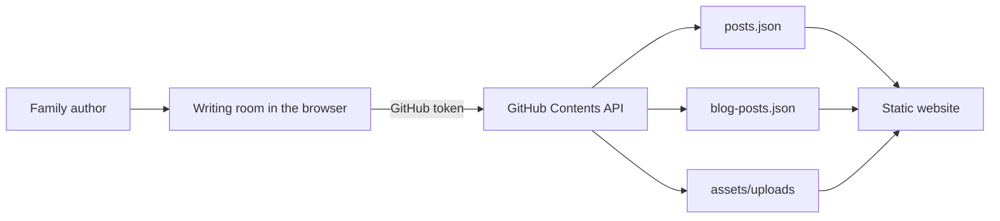

# Christoforakis.com

A small, expressive family website: one shared front door, six individual worlds, a permanent home for Lukas's family updates, and a photograph-friendly notebook for Oksana.

The site is intentionally built as a static website. It has no framework, package manager, database, build pipeline, or server-side application. HTML, CSS, browser JavaScript, JSON, and image assets are all that is required to run it. Publishing from the private writing room uses GitHub's Contents API to update those same JSON and image files.

> Project status: the redesign is implemented locally. Publishing or deploying it is a separate, deliberate step.

## Contents

1. [Experience overview](#experience-overview)
2. [Routes](#routes)
3. [Project structure](#project-structure)
4. [How the site works](#how-the-site-works)
5. [Design system](#design-system)
6. [Content files and schemas](#content-files-and-schemas)
7. [The writing room](#the-writing-room)
8. [Initial editor setup](#initial-editor-setup)
9. [Security model](#security-model)
10. [Local development](#local-development)
11. [Editing the site](#editing-the-site)
12. [Publishing and deployment](#publishing-and-deployment)
13. [Testing and quality checks](#testing-and-quality-checks)
14. [Accessibility](#accessibility)
15. [Privacy and sensitive content](#privacy-and-sensitive-content)
16. [Troubleshooting](#troubleshooting)
17. [Recovery and rollback](#recovery-and-rollback)
18. [Intentional constraints](#intentional-constraints)
19. [Maintenance checklist](#maintenance-checklist)

## Experience overview

The landing page is a map rather than a conventional stack of profile cards. Each member of the family occupies a distinct visual region, built from the supplied Super Visuals background library:

- Nicholas: Middlebury and Loom, his time-aware ADHD scheduling app.
- Andreas: a high-school-senior page ready for more detail later.
- Lukas: an illustrated interest board for airliners, U.S. military jets, and Formula 1.
- Oksana: a personal notebook for photographs and written posts.
- Kiriakos: a small-business-owner page ready for more detail later.
- Foxy: the family's orange, cream, and black shepherd mix.

Lukas's medical and family updates have moved out of the landing page and into a searchable archive at `/updates/`. The newest update is still surfaced on the home page, so important news remains easy to find without defining the entire family landing experience.

## Routes

| Route | Purpose | Content source |
| --- | --- | --- |
| `/` | Magical family landing page and latest-update preview | `index.html`, `posts.json` |
| `/nicholas/` | Nicholas, Middlebury, and Loom | `nicholas/index.html` |
| `/andreas/` | Andreas's profile placeholder | `andreas/index.html` |
| `/lukas/` | Lukas's interests and link to family updates | `lukas/index.html` |
| `/oksana/` | Oksana's notebook and photograph feed | `oksana/index.html`, `blog-posts.json` |
| `/kiriakos/` | Kiriakos's profile placeholder | `kiriakos/index.html` |
| `/foxy/` | Foxy's profile | `foxy/index.html` |
| `/updates/` | Searchable archive of Lukas's family updates | `updates/index.html`, `posts.json` |
| `/admin.html` | Private browser-based writing room | `admin.html`, GitHub Contents API |
| `/planner/` | Existing planner retained from the previous site | `planner/index.html` |

All public pages share the same injected family navigation and footer. The editor is visually related but intentionally has its own focused layout.

## Project structure

```text
christoforakis.com/
├── index.html                    # Landing page
├── admin.html                    # GitHub-backed writing room
├── posts.json                    # Lukas update archive
├── blog-posts.json               # Oksana notebook posts
├── tokens.css                    # Shared visual tokens
├── favicon.svg
├── og-image.png                  # Existing social image
├── README.md
├── CONTENT-GUIDE.md
├── assets/
│   ├── backgrounds/
│   │   ├── landing.webp
│   │   ├── nicholas.webp
│   │   ├── andreas.webp
│   │   ├── lukas.webp
│   │   ├── oksana.webp
│   │   ├── kiriakos.webp
│   │   └── foxy.webp
│   ├── css/
│   │   ├── site.css              # Public-page layout and components
│   │   └── admin.css             # Writing-room styles
│   ├── js/
│   │   ├── site.js               # Shared navigation, footer, motion, latest update
│   │   ├── updates.js            # Updates feed, search, share links
│   │   ├── blog.js               # Oksana notebook feed
│   │   └── admin.js              # Authentication, editor, upload, publishing
│   └── uploads/                  # Created automatically after notebook image uploads
├── nicholas/index.html
├── andreas/index.html
├── lukas/index.html
├── oksana/index.html
├── kiriakos/index.html
├── foxy/index.html
├── updates/index.html
├── planner/index.html            # Retained existing page
└── .hallmark/
    ├── preflight.json            # Recorded design direction
    └── log.json                  # Hallmark design log
```

The local source file `Super Visuals_ Backgrounds Library..fig` and the temporary `.fig-preview/` extraction workspace are intentionally ignored by Git. The optimized images actually used by the site live in `assets/backgrounds/`.

## How the site works

### Public pages

The public experience is progressively enhanced:

1. Each route is a complete semantic HTML document.
2. `tokens.css` and `assets/css/site.css` provide the shared visual system.
3. `assets/js/site.js` inserts the consistent header and footer, then adds optional motion and latest-update loading.
4. Data-backed pages fetch their JSON file over HTTP and construct safe DOM nodes with `textContent`.

The public scripts do not use `innerHTML` for post content. User-written titles, paragraphs, dates, and image descriptions are assigned through DOM properties, which prevents authored text from being interpreted as executable markup.

### Publishing flow



There is no separate admin server. When an authorized author presses **Publish changes**, the browser writes a commit to the repository's `main` branch through the GitHub Contents API. The public pages subsequently read the updated static files.

## Design system

### Direction

The site uses a custom Hallmark treatment built on these foundations:

- Macrostructure: **Map / Diagram**. The family is presented as six destinations instead of a repetitive card grid.
- Theme foundation: **Hum**. Warm off-white surfaces, dark ink, compact labels, and bright color accents keep the experience lively without making it childish.
- Imagery: optimized crops derived from the user-supplied Super Visuals Figma library.
- Interaction: Apple-inspired physical feedback, restrained spring-like motion, spatial consistency, translucent material only where it supports navigation, and a complete reduced-motion path.

### Tokens

`tokens.css` is the source of truth for shared color, type, spacing, radius, shadow, and motion values. Prefer an existing token before introducing a literal value into a component stylesheet.

The core typefaces are loaded from Google Fonts:

- Plus Jakarta Sans for interface and display typography.
- JetBrains Mono for dates, labels, and small technical metadata.

The CSS includes system fallbacks. If the font request is blocked, the site remains readable and usable.

### Shared public components

- Sticky site header with a click-open family directory.
- Keyboard-operable mega menu with Escape-to-close and returned focus.
- Consistent utility navigation to Updates and Oksana's notebook.
- Physical press buttons and link affordances.
- Reusable profile hero, fact rows, editorial blocks, and call-to-action bands.
- Statement footer: “Five people. One dog. Plenty happening.”
- Optional reveal motion that is disabled when reduced motion is requested.

### Background asset policy

The seven production background files are WebP images sized for the site, rather than full-resolution design exports. When replacing one:

1. Start with a licensed or family-owned source.
2. Export an image large enough for a high-density display, but no larger than needed.
3. Prefer WebP for photographic or texture-heavy art.
4. Check the crop at wide desktop and narrow mobile widths.
5. Keep the original design source outside Git unless it is genuinely needed by collaborators.
6. Confirm that the total page weight remains reasonable.

## Content files and schemas

### Lukas updates: `posts.json`

The updates archive is an array of objects:

```json
[
  {
    "id": "a-stable-unique-id",
    "date": "2026-07-15",
    "title": "A clear update title",
    "isNew": true,
    "pinned": false,
    "body": [
      "The opening paragraph appears before the expandable section.",
      "Each additional array item becomes another paragraph in the full update."
    ]
  }
]
```

Field rules:

| Field | Required | Meaning |
| --- | --- | --- |
| `id` | Yes | Stable HTML fragment identifier used by share links. Do not change it after publishing. |
| `date` | Yes | Calendar date in `YYYY-MM-DD` format. |
| `title` | Yes | Human-readable update title. |
| `isNew` | Yes | Shows the “New” badge when `true`. This is manually controlled. |
| `pinned` | Yes | Moves the update ahead of the date-sorted archive when `true`. |
| `body` | Yes | Ordered array of plain-text paragraphs. The first paragraph is always visible. |

Pinned posts sort first; posts within the same pinned state sort newest first. Search matches both the title and all body paragraphs.

### Oksana's notebook: `blog-posts.json`

The notebook is also an array of objects:

```json
[
  {
    "id": "notebook-a-stable-unique-id",
    "date": "2026-07-15",
    "title": "A note from today",
    "body": [
      "The first paragraph.",
      "A second paragraph."
    ],
    "image": "/assets/uploads/2026-07-15-a-note-from-today-abc12.webp",
    "imageAlt": "A concise description of what is visible in the photograph"
  }
]
```

Field rules:

| Field | Required | Meaning |
| --- | --- | --- |
| `id` | Yes | Stable unique identifier and URL fragment. |
| `date` | Yes | Calendar date in `YYYY-MM-DD` format. |
| `title` | Yes | Notebook entry title. |
| `body` | Yes | Ordered array of plain-text paragraphs. |
| `image` | No | Root-relative path to an uploaded image. |
| `imageAlt` | Required with image | Useful description for someone who cannot see the image. |

Notebook posts sort newest first. A text-only post is valid; an image is never required.

### Plain text, deliberately

Post bodies do not accept HTML or Markdown. This is intentional:

- Authors cannot accidentally break the layout.
- The public rendering path stays simple and resistant to script injection.
- The editor remains friendly to nontechnical family members.
- A blank line reliably means “start a new paragraph.”

If rich text becomes important later, add a carefully sanitized renderer rather than passing authored HTML directly into a page.

## The writing room

`/admin.html` supports two collections:

- **Updates** edits `posts.json` and exposes the New and Pinned controls.
- **Notebook** edits `blog-posts.json` and exposes photograph upload and image-description fields.

### Editor behavior

- A title, date, and at least one paragraph are required.
- Blank lines split the post into paragraph-array items.
- If a notebook entry has an image, an image description is required.
- Removing a post is reversible with **Undo** for eight seconds and is not permanent until publishing.
- Leaving the page with unpublished changes triggers the browser's unsaved-changes warning.
- Switching collections with unpublished changes asks for confirmation.
- The public page can be opened in a separate tab from the editor toolbar.

### What publishing changes

For a text-only post, one repository commit updates the collection JSON file.

For a new notebook image, publishing normally creates two commits:

1. The original image is uploaded to `assets/uploads/`.
2. `blog-posts.json` is updated to reference that path.

If the second operation fails after the image upload succeeds, the repository can contain an unused image. This is harmless, but it should be removed manually after confirming that no post references it.

## Initial editor setup

The editor expects a fine-grained GitHub personal access token restricted to this repository. GitHub's current setup screens can change; consult the official [personal access token guide](https://docs.github.com/en/authentication/keeping-your-account-and-data-secure/managing-your-personal-access-tokens) if the labels differ.

1. Sign in to the GitHub account that is allowed to edit `Sparkbiscuit/christoforakis-site`.
2. Open GitHub **Settings → Developer settings → Personal access tokens → Fine-grained tokens**.
3. Create a token with an appropriate expiration date.
4. For repository access, choose **Only select repositories** and select `christoforakis-site`.
5. Under repository permissions, grant **Contents: Read and write**.
6. Do not grant unrelated permissions.
7. Copy the token immediately; GitHub will not show the complete value again.
8. Open `/admin.html` on the deployed site.
9. Choose a local writing-room password of at least eight characters and confirm it.
10. Paste the GitHub token.
11. Leave **Remember the GitHub token on this device** unchecked on any shared device. When unchecked, the token lasts for the current browser session only.
12. Submit the form. The editor verifies the token by reading `posts.json` before it stores the local setup.

GitHub documents endpoint-specific fine-grained token permissions in its [permissions reference](https://docs.github.com/en/rest/authentication/permissions-required-for-fine-grained-personal-access-tokens). The editor needs repository Contents access because it reads and replaces JSON files and creates image files.

## Security model

Read this section before giving someone access to the writing room.

### What the local password does

On first setup, the browser hashes the chosen password with SHA-256 and stores only the hash in local storage under `christoforakis_admin_hash`. On later visits, the entered password is hashed and compared in the browser.

This local password is an interface lock. It is useful for preventing casual access by another person using the same browser profile, but it is **not server-side authentication** and should not be treated as a high-security boundary.

### What the GitHub token does

The GitHub token is the real publishing credential. Anyone who obtains it can use its granted permissions independently of this website. Keep its repository scope narrow, give it only Contents read/write access, and choose a reasonable expiration date.

Token storage behavior:

- Default: `sessionStorage` under `christoforakis_github_session_token`. It is cleared when the browser session ends and when the editor's **Lock** action is used.
- Remembered: also stored in `localStorage` under `christoforakis_github_token`. It remains until removed, browser storage is cleared, or setup is reset.
- Session unlock state: `sessionStorage` under `christoforakis_admin_session`.

### Operational rules

- Do not open or configure the writing room on a public or shared computer.
- Do not send a token through email, text, chat, or screenshots.
- Do not commit a token to this repository.
- Revoke and replace the token immediately if it may have been exposed.
- Use a dedicated, repository-scoped fine-grained token rather than a broadly privileged classic token.
- Review GitHub's token expiration and access periodically.
- Keep `/admin.html` out of search results. It currently declares `noindex, nofollow`, but that is not an access-control mechanism.
- Remember that any script executing on the same website origin could potentially access browser storage. Keep third-party scripts to an absolute minimum.

### Resetting local editor setup

In the browser's developer console on the site origin, the following removes the local password, remembered token, session token, and unlock state:

```js
localStorage.removeItem("christoforakis_admin_hash");
localStorage.removeItem("christoforakis_github_token");
sessionStorage.removeItem("christoforakis_github_session_token");
sessionStorage.removeItem("christoforakis_admin_session");
location.reload();
```

This does not revoke a token on GitHub. Revoke it separately in GitHub settings if it should no longer work.

## Local development

The site must be served over HTTP. Opening the HTML files directly with `file://` prevents the JSON `fetch()` calls from behaving like they do in production.

From the repository root:

```bash
python3 -m http.server 4173 --bind 127.0.0.1
```

Then open:

```text
http://127.0.0.1:4173/
```

Useful local routes:

```text
http://127.0.0.1:4173/updates/
http://127.0.0.1:4173/oksana/
http://127.0.0.1:4173/admin.html
```

Stop the server with `Control-C` in the terminal that started it.

### Important local-editor limitation

The writing room always publishes to the configured GitHub repository and `main` branch, even when the page itself is served from localhost. Opening the local editor is safe; pressing **Publish changes** with a valid token is an external write to GitHub. Use manual JSON edits for local-only content experiments.

## Editing the site

### Change a family profile

Edit the appropriate route's `index.html`. Keep the established structure where possible:

- A shared header placeholder: `<div data-site-header></div>`
- A `<main id="main">` landmark
- The profile's hero and page-specific sections
- A shared footer placeholder: `<div data-site-footer></div>`
- `/assets/js/site.js` loaded with `defer`

The family labels and URLs in the mega menu live in the `family` array near the top of `assets/js/site.js`. If a person's title or path changes, update both the relevant page and this array.

### Change global colors, spacing, or type

Start in `tokens.css`. Component-specific layout belongs in `assets/css/site.css` or `assets/css/admin.css`. Avoid scattering new color literals across component rules.

### Change shared navigation or footer content

Edit `headerMarkup()` or `footerMarkup()` in `assets/js/site.js`. Because these are shared templates, test at least the landing page, a profile page, the updates page, and mobile navigation afterward.

### Edit posts without the writing room

You can edit `posts.json` or `blog-posts.json` directly. Preserve valid JSON:

- Double-quote property names and text values.
- Do not leave a trailing comma after the last item.
- Keep dates in `YYYY-MM-DD` format.
- Keep every ID unique and stable.
- Represent paragraphs as an array of strings.
- Escape literal double quotes inside a string as `\"`.

Validate the result before committing:

```bash
python3 -m json.tool posts.json >/dev/null
python3 -m json.tool blog-posts.json >/dev/null
```

### Add or replace an image manually

1. Put the optimized file in `assets/uploads/`.
2. Use a lower-case, descriptive, hyphenated filename.
3. Reference it with a root-relative URL such as `/assets/uploads/example.webp`.
4. Add a useful `imageAlt` value.
5. Load the page at mobile and desktop sizes and check the crop.

Avoid putting private EXIF location data into public images. Exporting through an image editor usually strips it, but verify when a photograph's location is sensitive.

## Publishing and deployment

The repository contains a deployable static site and requires no build command. The exact hosting configuration is managed outside these files, so verify the current repository Pages or hosting settings before changing branches, DNS, or custom-domain configuration.

A safe code-release sequence is:

```bash
git status --short --branch
git diff --check
git diff --stat
git add <intentional files>
git commit -m "Redesign family website"
git push origin main
```

Before committing:

- Confirm `Super Visuals_ Backgrounds Library..fig` and `.fig-preview/` are not staged.
- Confirm no GitHub token or other secret appears in the diff.
- Confirm `posts.json` still contains the complete update archive.
- Confirm the existing planner was not changed unintentionally.
- Run the verification checklist below.

After pushing:

1. Wait for the configured host to finish deploying.
2. Open the production home page in a private browser window.
3. Test a family route, the family menu, Updates, and Oksana's notebook.
4. Confirm the custom domain and HTTPS certificate remain healthy.
5. Test the writing room only if a publishing test is intended; it can create a real commit.

## Testing and quality checks

There is no bundled test runner, so verification combines syntax checks, JSON validation, local-link inspection, and browser testing.

### JavaScript syntax

```bash
node --check assets/js/site.js
node --check assets/js/updates.js
node --check assets/js/blog.js
node --check assets/js/admin.js
```

### JSON validity

```bash
python3 -m json.tool posts.json >/dev/null
python3 -m json.tool blog-posts.json >/dev/null
python3 -m json.tool .hallmark/preflight.json >/dev/null
python3 -m json.tool .hallmark/log.json >/dev/null
```

### Patch hygiene

```bash
git diff --check
git status --short --branch
```

### Manual browser matrix

At minimum, test:

| Area | Desktop | Narrow mobile | Keyboard |
| --- | --- | --- | --- |
| Landing map | No overlap; backgrounds crop well | One-column map; no horizontal scroll | Family menu opens and closes |
| Family menu | Directory fits viewport | Directory scrolls internally | First link receives focus; Escape returns focus |
| Updates | Seven existing entries load; pinned entry leads | Search and details remain usable | Search, details, and share button are reachable |
| Oksana notebook | Empty or populated state is intentional | Images do not overflow | Links and posts follow reading order |
| Profiles | Hero and calls to action are legible | No clipped heading or artwork | Focus state is visible |
| Writing room | Setup/login/editor layouts fit | Editor controls remain usable | Labels, tab controls, and actions are reachable |

Also test with the operating system's **Reduce Motion** setting enabled. Reveals and decorative bursts should be removed without hiding content.

### Browser-console expectations

Public routes should load without console errors or missing local assets. A failed Google Fonts request should not break the layout because system fallbacks are present. The writing room may report GitHub errors when no valid token is supplied; that is expected until setup is complete.

## Accessibility

The implementation includes:

- A skip link to the main landmark.
- Semantic landmarks and heading order.
- Visible keyboard focus states.
- A click-controlled menu with `aria-expanded`, Escape handling, and focus return.
- Minimum practical touch-target sizes.
- Reduced-motion behavior.
- Live status regions for search counts, publishing state, and copied links.
- Required image descriptions in the notebook editor.
- Text content rendered as text rather than injected HTML.
- Layout rules that prevent long headings from causing horizontal overflow.

Accessibility still depends on authored content. See `CONTENT-GUIDE.md` for image-description, title, language, privacy, and review guidance.

## Privacy and sensitive content

This is a public family website. The updates archive includes detailed medical history and should be handled with unusual care.

Before publishing, check for:

- Full names or identifying details of other patients, donors, clinicians, schools, or private individuals.
- Exact real-time locations, travel plans, appointment schedules, or home routines.
- Medical details Lukas or the family may not want permanently indexed.
- Photographs containing patient boards, wristbands, addresses, license plates, documents, screens, or bystanders.
- Image metadata that may reveal a private location.
- Statements about another person's health or circumstances that they have not approved.

Assume that a published post can be copied, archived, quoted, and retained even after it is removed from the site. Deleting a post from the current JSON does not erase it from Git history or third-party caches.

For health information, write from the family's direct experience, avoid implying medical advice, and have another family member review high-stakes claims before publishing.

## Troubleshooting

### Posts do not load locally

**Likely cause:** the page was opened with `file://` or the server was started outside the repository root.

**Fix:** start `python3 -m http.server 4173 --bind 127.0.0.1` from this directory and use `http://127.0.0.1:4173/`.

### The editor says “Bad credentials” or returns 401

**Likely cause:** the token was copied incorrectly, expired, or revoked.

**Fix:** generate a new fine-grained token, verify that the entire value was copied, and reset or replace the token stored in this browser.

### The editor returns 403

**Likely cause:** the token can see the account but lacks access to this repository or lacks Contents read/write permission.

**Fix:** inspect the token's repository selection and permissions. Confirm it includes `Sparkbiscuit/christoforakis-site` and repository Contents read/write access.

### Publishing reports a conflict or SHA error

**Likely cause:** the JSON file changed on GitHub after the editor loaded it, so the editor's copy is stale.

**Fix:** copy any unpublished text somewhere safe, reload the writing room to obtain the newest file version, reapply the edit, and publish again. Do not have two people edit the same collection simultaneously.

### An uploaded image exists but the notebook post does not

**Likely cause:** the image commit succeeded and the subsequent JSON commit failed.

**Fix:** first check whether any notebook entry references the image path. If not, either retry the post with the existing path through a manual JSON edit or delete the unused image in a separate repository commit.

### The remembered token should be removed

Use **Lock**, clear the site's local storage, or run the reset snippet in [Resetting local editor setup](#resetting-local-editor-setup). If the token might be compromised, revoke it on GitHub as well.

### A background is missing

Check that the requested path begins with `/assets/backgrounds/`, the filename's letter case matches exactly, and the WebP file is committed. Production hosts are commonly case-sensitive even when a macOS development machine is not.

### Navigation works locally but not on a subpath deployment

The site uses root-relative URLs such as `/updates/`. It expects to be hosted at the root of a domain, which matches `christoforakis.com`. Hosting it under a nested path requires rewriting those URLs or configuring the host accordingly.

## Recovery and rollback

Every writing-room publication is a Git commit, so GitHub history is the recovery log.

To restore an accidentally changed collection:

1. Open the repository's commit history.
2. Locate the last correct version of `posts.json` or `blog-posts.json`.
3. Review the diff carefully.
4. Restore the desired content in a new commit; avoid rewriting published history.
5. Reload the production page without cache and confirm the result.

For an accidentally removed image, restore the file from the commit that still contains it and confirm the post's `image` path matches.

Avoid destructive Git commands during recovery. A new corrective commit preserves a clear audit trail and is safer for a live family site.

## Intentional constraints

The following are deliberately not part of this version:

- A database or server-side CMS.
- User accounts, password reset email, or role-based permissions.
- Comments, likes, or public submissions.
- Analytics or behavioral tracking.
- Contact forms or newsletter collection.
- Rich-text HTML editing.
- Automatic image resizing after upload.
- Automatic removal of New badges.
- Automatic medical, privacy, spelling, or factual review.
- A JavaScript build toolchain.

These choices keep the site fast, legible, easy to host, and inexpensive to maintain. They also mean that editor access and public-content review remain human responsibilities.

## Maintenance checklist

### Before every content publication

- Read the complete post once outside the editor.
- Confirm the date and title.
- Confirm New and Pinned flags are intentional.
- Review privacy and medical details.
- Check every photograph and its description.
- Preview the public page after publishing.

### Monthly

- Check the home page, Updates, and notebook for broken assets.
- Remove stale New badges.
- Confirm the GitHub token has not unexpectedly expired.
- Review whether the pinned update is still the right one.

### Quarterly

- Review token scope and expiration.
- Test keyboard navigation and reduced motion.
- Check the site at a narrow mobile width.
- Review public content for outdated location or schedule details.
- Confirm the domain, HTTPS, and hosting configuration are healthy.

### When adding a new feature

- Preserve the static, progressive-enhancement baseline unless the feature truly requires a backend.
- Add reusable values to `tokens.css`.
- Test without animation and at narrow widths.
- Render authored content safely.
- Document new data fields and publishing behavior here.
- Update `CONTENT-GUIDE.md` if the authoring workflow changes.
